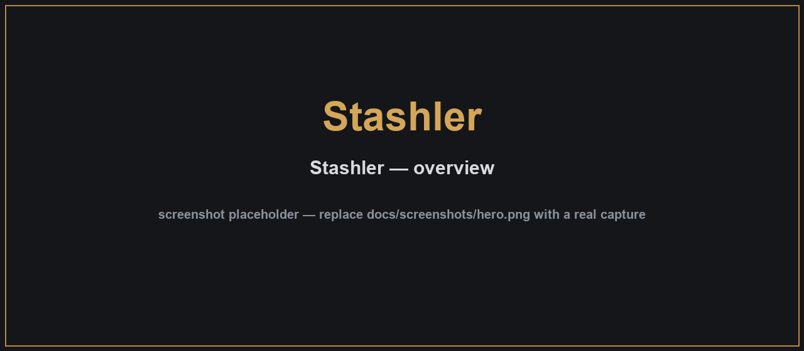
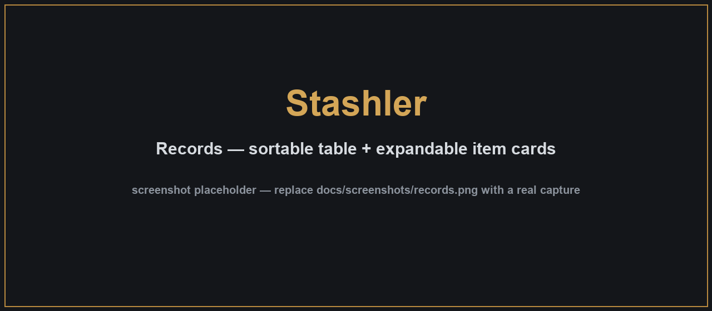
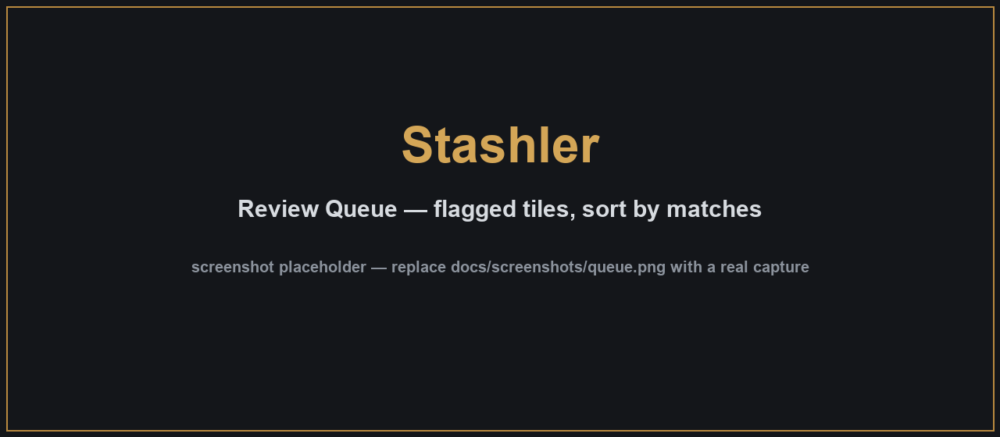
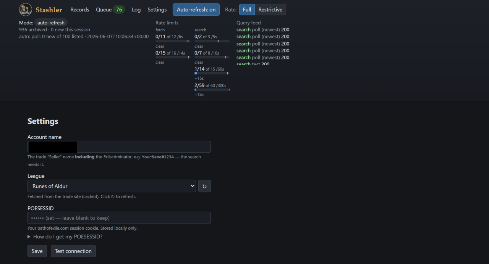
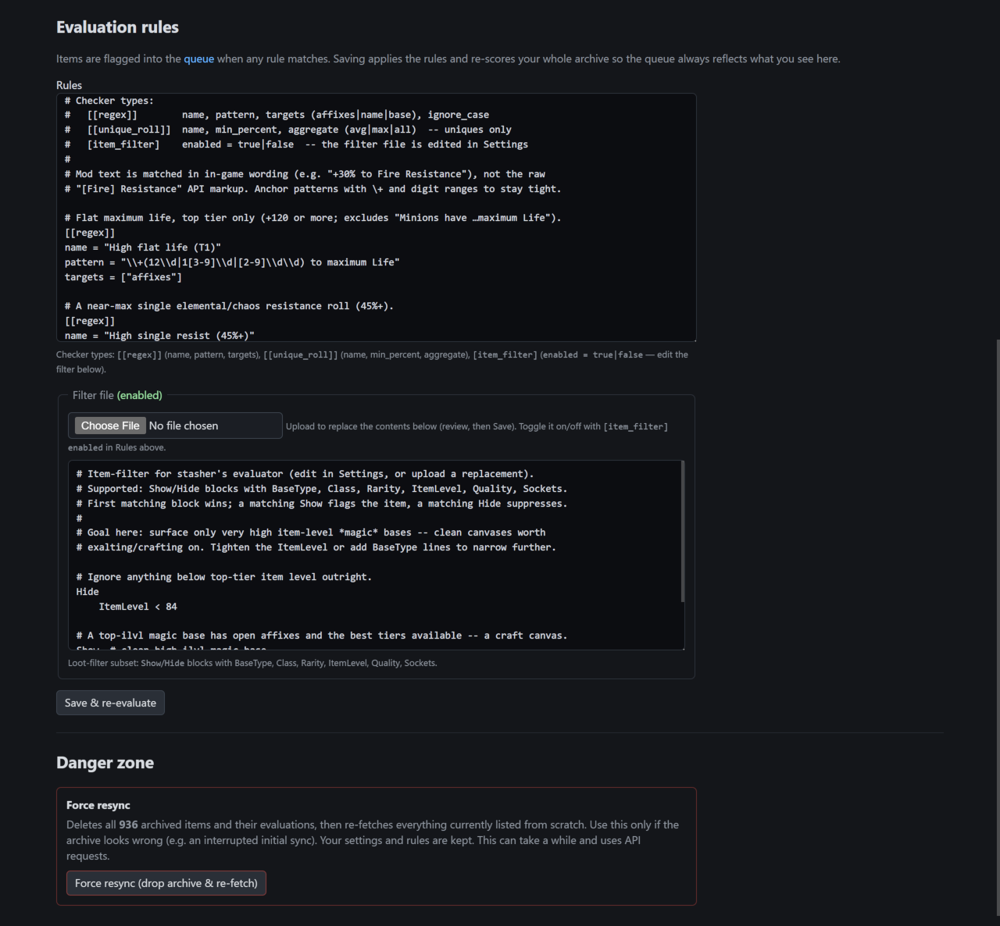

# Stashler

Archives your own Path of Exile 2 trade listings and flags the ones worth a closer look.

Stashler captures every item you have listed on the PoE2 trade site, scores each against
editable rules, and shows you the small number that match. It's a local desktop app with a
tray icon and a browser UI. Nothing leaves your machine.



---

## Get started

### Standalone app (no Python)

1. Build or download `Stashler.exe` (see [Building the .exe](#building-the-exe)) and run it.
2. Click the tray icon → **Open Stashler** to open the UI in your browser.
3. In **Settings**, enter your **account name** and **POESESSID**, pick your **League**,
   and click **Test connection**.
4. Click **Auto-refresh** in the top bar. Items start showing up in Records, and matches
   appear in the Queue.

### From source

```bash
pip install -e .
python -m stasher.cli tray      # tray app   (or: ... ui  for just the browser UI)
```

The UI runs at `http://127.0.0.1:7137`. Credentials, league, and rules are all set in the
UI — no config files to edit.

---

## The UI

### Records

A table of every captured item. Search by name/type, filter by rarity or "flagged only",
and sort any column, including **Matches** (how many rules an item hit). Click a row to
expand the item card: properties, item level, mods with their **P#/S# tier tags**, DPS,
and which rules flagged it.



### Queue

The items that matched at least one rule. Each one is a card with a **tile per rule match**.
Sort by **newest** or **most matches**, **Mark seen** to hide reviewed items, or **Mark all
seen**. The nav badge and the browser tab title show the unseen count.



### Settings

Account name, POESESSID (with a short guide for finding it), and a **League** dropdown
fetched from the trade site. **Test connection** runs one search to confirm it works. Below
that is an editor for your **rules** and **item filter** — **Save** validates and re-scores
the whole archive. **Danger zone → Force resync** wipes and re-fetches the archive.



The top bar also has a **Log** (the raw query feed) and a rate-limit display. Stashler stays
well under the trade API limits — going over them causes a 15–30 minute lockout.

---

## How scoring works

Listing prices aren't reliable, so Stashler scores items **locally** from the archived item
data (affixes, tiers, roll ranges, base, item level, unique name). If **any** rule matches,
the item is flagged with the reason. The default rules are tight on purpose — they aim to
surface only the few items worth checking.



Three rule types, edited in **Settings** (or in `rules.toml`):

```toml
[[regex]]                  # match name / base / affix text (in-game wording)
name = "High flat life (T1)"
pattern = "\\+(12\\d|1[3-9]\\d|[2-9]\\d\\d) to maximum Life"
targets = ["affixes"]      # affixes | name | base

[[unique_roll]]            # uniques rolling near the top of their ranges
name = "High-roll unique"
min_percent = 90
aggregate = "avg"          # avg | max | all

[item_filter]              # a single loot-filter file, edited/uploaded in the UI
enabled = true             # Show/Hide blocks: BaseType, Class, Rarity, ItemLevel, Quality, Sockets
```

Adjust the thresholds to your league. Saving in the UI re-scores the archive, so the Queue
always matches the current rules.

---

## Keeping the archive current

Click **Auto-refresh** (or run `stasher watch`). It does a cheap newest-first poll every few
minutes — one search, then fetches only listings you don't already have. A full backfill
runs only when a poll shows it might have missed something, not on a timer, and it also
seeds a new archive on first run. Repeat runs are nearly free.

The trade **live websocket** isn't used: on PoE2 the new-item feed is encrypted and only the
official client can read it, so Auto-refresh is the way to stay current.

---

## Where data is stored

The database, rules, and filter live in a per-user folder:

| OS | Location |
|----|----------|
| Windows | `%LOCALAPPDATA%\Stashler\` |
| macOS | `~/Library/Application Support/Stashler/` |
| Linux | `$XDG_DATA_HOME/Stashler/` (or `~/.local/share/Stashler/`) |

Your POESESSID stays on this machine. Override with `--db`, `STASHER_DATA`, or
`data_dir`/`db_path` in config. The UI prints the active folder on launch.

---

## For developers

```bash
pip install -e ".[dev]"
python -m pytest
python -m stasher.cli --help
```

| command | what it does |
|---------|--------------|
| `tray` | tray app (Open UI / Quit) |
| `ui` | web UI on `:7137` (`--port` to change) |
| `watch` | auto-refresh loop |
| `backfill` | one-shot capture of current listings |
| `evaluate` | re-score the archive (`--force` re-checks all) |

As a library:

```python
from stasher import Stasher
s = Stasher.from_config()
s.backfill()
print(s.db_path)
```

### Building the .exe

```bash
pip install -e ".[build]"
python build.py             # -> dist/Stashler.exe
```

### Data model

Items go in the `items` table (hash, account, timestamps, price, name/type/rarity, whisper,
full listing+item JSON). Scores go in a separate `evaluations` table (flagged, reasons,
seen), which you can recompute any time with `stasher evaluate --force`.
